# TriWorld — Hermes START HERE

Toto je jediný vstupný bod pre Hermesa. Cieľom je premeniť `C:\TriWorld` na produkčný „one-click“ generátor, ktorý zo zvoleného územia vytvorí deterministický, prenosný, overený a skutočne jazditeľný BeamNG.drive map ZIP.

## 1. Najprv nič nemaž

Adresár už obsahuje počiatočný návrhový scaffold a môže obsahovať ďalšie používateľské zmeny. Greenfield znamená, že architektúru nemusíš spätne kompatibilne prispôsobovať starému produktu; neznamená to, že môžeš vyčistiť pracovný strom.

Prvý bezpečný audit v PowerShelli:

```powershell
Set-Location -LiteralPath 'C:\TriWorld'
git status --short --branch
git rev-parse --show-toplevel
rg --files -g '!node_modules' -g '!dist' -g '!build'
Get-ChildItem Env: | Where-Object Name -Match 'KEY|TOKEN|SECRET|PASSWORD'
```

Posledný príkaz používaj iba na zistenie názvov premenných; ich hodnoty nezobrazuj, nekopíruj a nezapisuj.

## 2. Povinné čítanie

Prečítaj celé súbory, nie iba nadpisy:

1. `.hermes.md`
2. `HERMES_TRIWORLD_MASTER_PROMPT_2026.md`
3. `docs/resources/README.md`
4. `RESEARCH.md`
5. `docs/operations/risk_register.md`
6. `docs/operations/state_machine.md`
7. `docs/operations/test_matrix.md`
8. všetky existujúce ADR a contracts

Ak sú dokumenty v rozpore, nezvoľ si pohodlnejší. Zaznamenaj rozpor do evidence ledgeru a rozhodni podľa presnej nainštalovanej verzie, primárneho zdroja a malého runtime canary.

## 3. Povinný úvodný výstup

Pred veľkou implementáciou vytvor alebo aktualizuj:

- `docs/implementation-status.md`
- `docs/research/environment-report.md`
- `docs/research/evidence-ledger.md`
- `docs/research/version-lock.md`
- relevantné ADR
- kanonické contracts
- test matrix a risk register

Prvý report musí uviesť:

```text
Repository:
Branch:
Dirty/untracked files preserved:
Detected Python/Node/GDAL/PROJ/SUMO/Blender:
BeamNG install and version:
Web search backend:
Delegation configuration:
NotebookLM mode: disabled | manual | enterprise-preview
First vertical-slice milestone:
Current blockers:
```

## 4. Výskumný bootstrap

Hermes má použiť svoj natívny web research:

```text
hermes tools
hermes setup
```

Vyber fungujúci search backend a, ak treba, samostatný extract backend. Nikdy nezapisuj API kľúče do tohto repozitára. Pre každý zásadný výsledok otvor plnú oficiálnu stránku alebo source file; search snippet nie je dôkaz.

Nastav konzervatívnu delegáciu:

```yaml
delegation:
  max_concurrent_children: 3
  max_spawn_depth: 1
  orchestrator_enabled: true
```

Subagenti majú najprv vykonať iba nezávislý read-only research. Hlavný Hermes integruje výsledky. Presné roly a návratový formát sú v `docs/resources/SUBAGENT_PLAYBOOK.md`.

NotebookLM zapni iba ako voliteľnú evidence workbench podľa `docs/resources/NOTEBOOKLM_PLAYBOOK.md`. Ak používateľ neposkytol nakonfigurovaný Gemini Notebook Enterprise projekt a licenciu, predpokladaj manuálny browser workflow, nie API.

## 5. Poradie výstavby

```mermaid
flowchart LR
    A["Audit + evidence"] --> B["Contracts + state machine"]
    B --> C["Synthetic offline canary"]
    C --> D["BeamNG load-and-drive gate"]
    D --> E["MapFrame + OSM + DEM"]
    E --> F["SUMO topology gate"]
    F --> G["Civil 3D road + terrain formation"]
    G --> H["Road Architect bake + reload"]
    H --> I["Scenery, assets, materials, LOD"]
    I --> J["UI + one-click orchestration"]
    J --> K["Reproducible ZIP + runtime QA"]
```



Nezačni „kvalitou Italy“ cez množstvo assetov. Najprv dokáž korektný map frame, topológiu, fyzickú vozovku, terén, AI navigáciu, spawn, packaging a runtime reload. Detail, vegetácia, budovy, zvuk a art direction sú ďalšie vrstvy nad funkčným jadrom.

## 6. Minimálne invarianty mapy

- Jeden kanonický lokálny ENU/map frame; žiadne miešanie WGS84, projektovaných a BeamNG súradníc.
- Transformácie musia mať explicitný CRS, axis order, jednotky, origin a round-trip test.
- Road graph odlišuje križovanie v rovnakej výške od bridge/tunnel prekríženia.
- Centerline, lane graph, corridor, surface mesh, collision, DecalRoad a AI graph sa odvodzujú z jedného verzovaného RoadIR contractu.
- Kanonický TriWorld road node je `[x, y, z, halfWidth]`. BeamNG serializer nesmie predpokladať rovnakú externú semantiku: aktuálna class dokumentácia môže scalar nazývať `width`, takže target adapter musí full/half význam zmerať editor-save/reload canary testom a konverziu pokryť golden testom.
- Jednosmerná orientácia a lane connectivity sa testujú.
- Pozitívnu drivability má iba jedna autoritatívna AI vrstva.
- Fyzická cesta má spojitú kolíziu, kontrolovaný sklon, priečny sklon, obrubníky/ramená a napojenie na deformovaný terén.
- Road Architect build je platný až po finalize → save → reload → runtime test.
- ZIP používa relatívne cesty, obsahuje všetky redistribuovateľné závislosti, nemá cache/temp súbory a má stabilné poradie aj timestamp policy.

## 7. Kde hľadať pomoc

- Index zdrojov: `docs/resources/PRIMARY_SOURCES.md`
- Predpripravené dotazy: `docs/resources/SEARCH_QUERIES.md`
- Research proces: `docs/resources/RESEARCH_PLAYBOOK.md`
- Subagenti: `docs/resources/SUBAGENT_PLAYBOOK.md`
- NotebookLM: `docs/resources/NOTEBOOKLM_PLAYBOOK.md`
- Praktické hints: `docs/hints/HERMES_EXECUTION_HINTS.md`
- Nástroje a príkazy: `docs/resources/TOOLS_AND_COMMANDS.md`
- BeamNG runtime gate: `docs/resources/BEAMNG_RUNTIME_CHECKLIST.md`
- SUMO/GIS gate: `docs/resources/SUMO_GIS_QA_CHECKLIST.md`
- Evidence šablóna: `docs/resources/EVIDENCE_LEDGER_TEMPLATE.md`

## 8. Stop podmienky

Zastav konkrétnu fázu a pravdivo ju označ `blocked` alebo `not yet proven`, ak chýba licencia, zdroj dát, presný runtime symbol, BeamNG inštalácia, manuálna World Editor interakcia alebo dôkaz z gate. Nezastav celý projekt, ak možno bezpečne dokončiť contracts, offline canary, fixture, test alebo dokumentáciu bez predstierania runtime úspechu.

Teraz pokračuj master promptom. Neodovzdávaj ďalšiu všeobecnú esej; vytváraj malé overiteľné artefakty a zatváraj riziká dôkazmi.
