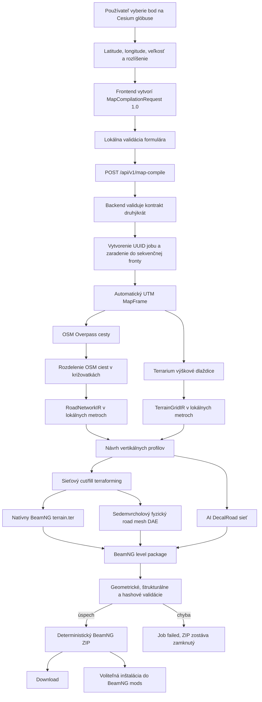

# Pipeline Architecture

```mermaid
flowchart TD
    A["Používateľ vyberie bod na Cesium glóbuse"] --> B["Latitude, longitude, veľkosť a rozlíšenie"]
    B --> C["Frontend vytvorí MapCompilationRequest 1.0"]
    C --> D["Lokálna validácia formulára"]
    D --> E["POST /api/v1/map-compile"]
    E --> F["Backend validuje kontrakt druhýkrát"]
    F --> G["Vytvorenie UUID jobu a zaradenie do sekvenčnej fronty"]
    G --> H["Automatický UTM MapFrame"]
    H --> I["OSM Overpass cesty"]
    H --> J["Terrarium výškové dlaždice"]
    I --> K["Rozdelenie OSM ciest v križovatkách"]
    K --> L["RoadNetworkIR v lokálnych metroch"]
    J --> M["TerrainGridIR v lokálnych metroch"]
    L --> N["Návrh vertikálnych profilov"]
    M --> N
    N --> O["Sieťový cut/fill terraforming"]
    O --> P["Natívny BeamNG terrain.ter"]
    O --> Q["Sedemvrcholový fyzický road mesh DAE"]
    N --> R["AI DecalRoad sieť"]
    P --> S["BeamNG level package"]
    Q --> S
    R --> S
    S --> T["Geometrické, štrukturálne a hashové validácie"]
    T -->|úspech| U["Deterministický BeamNG ZIP"]
    T -->|chyba| V["Job failed, ZIP zostáva zamknutý"]
    U --> W["Download"]
    U --> X["Voliteľná inštalácia do BeamNG mods"]
```
