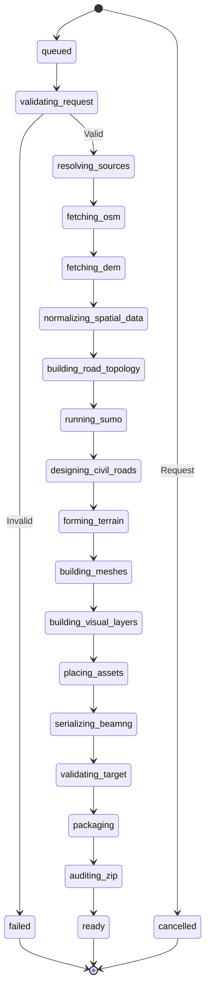

# State Machine: Job Compilation



## Stage Definitions

| Stage | Weight | Description |
|-------|--------|-------------|
| `validating_request` | 2% | Pydantic validation, budget checks |
| `resolving_sources` | 3% | Cache lookup, provider selection |
| `fetching_osm` | 8% | Overpass query with retry/backoff |
| `fetching_dem` | 8% | DEM tile download/mosaic |
| `normalizing_spatial_data` | 5% | Reprojection, MapFrame creation |
| `building_road_topology` | 10% | OSM → RoadNetworkIR, topology |
| `running_sumo` | 8% | netconvert, mapping, netcheck |
| `designing_civil_roads` | 15% | Horizontal clean, vertical QP, cross-sections, junctions |
| `forming_terrain` | 10% | Atomic road-first formation, cut/fill, blend |
| `building_meshes` | 10% | Chunked DAE, collision, LOD |
| `building_visual_layers` | 8% | Markings, edges, decals, materials |
| `placing_assets` | 5% | Guardrails, signs, vegetation, buildings |
| `serializing_beamng` | 5% | TSStatic, DecalRoad, TerrainBlock, info.json |
| `validating_target` | 3% | Structural audit, BeamNG staging validator |
| `packaging` | 2% | Deterministic ZIP creation |
| `auditing_zip` | 2% | ZIP auditor re-opens and verifies |

## Progress Event Schema
```json
{
  "jobId": "job_01",
  "stage": "forming_terrain",
  "stageProgress": 0.62,
  "overallProgress": 0.54,
  "message": "Blending road formation into DEM",
  "metrics": {"corridorsDone": 79, "corridorsTotal": 128}
}
```

## Terminal States
- `ready` — All gates passed, artifact available
- `failed` — Error with human + technical detail
- `cancelled` — User requested cancellation

## Recovery
- On restart: scan `artifacts/jobs/` for incomplete jobs
- Non-terminal → mark `failed` with "interrupted", allow retry
- Retry: new jobId, same request, reuse cached sources